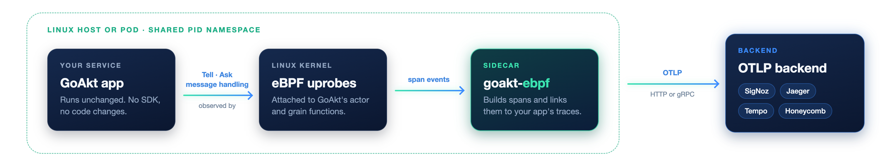

<h2 align="center">
  <br />
  eBPF tracing agent for GoAkt
</h2>

<p align="center">
  <a href="https://github.com/Tochemey/goakt-ebpf/actions/workflows/ci.yml"></a>
  <a href="https://codecov.io/gh/Tochemey/goakt-ebpf"></a>
  <a href="LICENSE"></a>
  <a href="https://join.slack.com/t/oss-r2l2029/shared_invite/zt-42zcqua8y-unSUH0tFlOQzwT_smzYfOQ"></a>
</p>

goakt-ebpf traces [GoAkt](https://github.com/tochemey/goakt) actor systems without touching your code. Point it at a running GoAkt application and it exports actor-level traces over OpenTelemetry: no code changes, no redeployment, and no SDK dependency in your app.

## Table of Contents

- [How It Works](#how-it-works)
- [Requirements](#requirements)
- [Quick Start](#quick-start)
  - [Docker (recommended)](#docker-recommended)
  - [Bare metal](#bare-metal)
  - [Try it locally](#try-it-locally)
- [Configuration](#configuration)
- [Deployment](#deployment)
  - [Docker Compose](#docker-compose)
  - [Kubernetes](#kubernetes)
- [Connecting App Spans to Actor Spans](#connecting-app-spans-to-actor-spans)
- [Distributed Tracing (Cross-Node)](#distributed-tracing-cross-node)
- [What You See in Traces](#what-you-see-in-traces)
- [Building from Source](#building-from-source)
- [Troubleshooting](#troubleshooting)
- [Documentation](#documentation)

## How It Works

The agent runs as a sidecar next to your GoAkt application. It attaches [eBPF](https://ebpf.io/) uprobes to GoAkt's actor and grain functions, turns what they observe into spans, and exports them over the [OpenTelemetry Protocol (OTLP)](https://opentelemetry.io/docs/specs/otlp/) to any compatible backend.

<p align="center">
  
</p>

If your application already creates OpenTelemetry spans, the agent links its actor spans under them, so one request shows up as one trace.

## Requirements

- **Linux with eBPF.** The agent needs a Linux kernel. On macOS, use [Lima](https://github.com/lima-vm/lima); Docker Desktop works only when its Linux VM supports eBPF (it worked with kernel 7.0). See the [integration example](examples/integration/README.md) for Lima setup.
- **GoAkt v4.6.1 or later** in the application you trace.
- **DWARF debug info** in the application binary. Do not build it with `-ldflags="-s -w"`.
- **Root with eBPF capabilities** for the agent: `SYS_PTRACE`, `SYS_ADMIN`, `BPF`, and `PERFMON`. The agent image's default user cannot attach, so run it as root, as every example below does.

## Quick Start

### Docker (recommended)

Run the agent in your application container's PID namespace, where your application is PID 1:

```bash
docker run --rm \
  --user root \
  --cap-add SYS_PTRACE --cap-add SYS_ADMIN --cap-add BPF --cap-add PERFMON \
  --pid=container:YOUR_GOAKT_APP \
  -e OTEL_EXPORTER_OTLP_ENDPOINT=http://otel-collector:4318 \
  ghcr.io/tochemey/goakt-ebpf:1.0.0 -pid 1
```

Image tags match release versions without the `v` prefix (`1.0.0`, not `v1.0.0`).

### Bare metal

Build the binary on Linux, or copy it out of the image, then point it at your application by PID or by executable path:

```bash
# Build from source (Linux)
go build -o goakt-ebpf ./cmd/cli/...

# Or copy the binary out of the image
docker run --rm --entrypoint cat ghcr.io/tochemey/goakt-ebpf:1.0.0 \
  /usr/local/bin/goakt-ebpf > goakt-ebpf && chmod +x goakt-ebpf

# Run
sudo ./goakt-ebpf -pid "$(pgrep -f your-goakt-app)"
# or
sudo ./goakt-ebpf -exe /path/to/your-goakt-app
```

### Try it locally

The integration example starts a GoAkt app, the agent, and a self-hosted [SigNoz](https://signoz.io/) UI with Docker Compose:

```bash
make build    # fetch SigNoz and build the images (the first run takes several minutes)
make start    # start the stack and send GET /echo and GET /ask
make view     # open SigNoz at http://localhost:8080
make down     # remove everything when you are done
```

Log in with `admin@goakt.local` / `GoAkt-eBPF-2026!` (local demo only). In **Traces**, switch to **Trace View** and open a `GET /echo` or `GET /ask` trace:

```
GET /ask                      ← integration-app (otelhttp)
  └── actor.doReceive         ← goakt-ebpf
        └── actor.process     ← goakt-ebpf
```

The app also sends `send-tell` and `send-ask` messages every 5 seconds, which produce the same three-level tree. For grains, see the [grains example](examples/grains/README.md).

## Configuration

| Flag                 | Environment variable          | Description                                                          |
|----------------------|-------------------------------|----------------------------------------------------------------------|
| `-pid <pid>`         | `GOAKT_EBPF_TARGET_PID`       | Target process ID. Use `1` when sharing the PID namespace.           |
| `-exe <path>`        |                               | Target executable path; the agent finds the matching running process. |
| `-log-level <level>` | `GOAKT_EBPF_LOG_LEVEL`        | `debug`, `info`, `warn`, or `error` (default `info`). The flag wins. |
|                      | `OTEL_EXPORTER_OTLP_ENDPOINT` | OTLP endpoint, for example `http://otel-collector:4318`.             |
|                      | `OTEL_EXPORTER_OTLP_PROTOCOL` | `http/protobuf` (default) or `grpc`.                                 |
|                      | `OTEL_SERVICE_NAME`           | Service name on exported spans (default `goakt-ebpf`).               |

## Deployment

### Docker Compose

```yaml
services:
  goakt-app:
    image: your-goakt-app:latest

  goakt-ebpf:
    image: ghcr.io/tochemey/goakt-ebpf:1.0.0
    user: root
    cap_add: [SYS_PTRACE, SYS_ADMIN, BPF, PERFMON]
    pid: "container:goakt-app"
    depends_on: [goakt-app]
    environment:
      OTEL_EXPORTER_OTLP_ENDPOINT: http://otel-collector:4318
    # Give the app a moment to start before attaching.
    entrypoint: ["/bin/sh", "-c", "sleep 3 && exec /usr/local/bin/goakt-ebpf -pid 1"]
```

### Kubernetes

Run the agent as a sidecar in the same pod with a shared process namespace:

```yaml
spec:
  shareProcessNamespace: true
  containers:
    - name: goakt-app
      image: your-goakt-app:latest
    - name: goakt-ebpf
      image: ghcr.io/tochemey/goakt-ebpf:1.0.0
      args: ["-exe", "/path/to/your-goakt-app"]
      securityContext:
        runAsUser: 0
        capabilities:
          add: [SYS_PTRACE, SYS_ADMIN, BPF, PERFMON]
      env:
        - name: OTEL_EXPORTER_OTLP_ENDPOINT
          value: "http://otel-collector:4318"
```

With `shareProcessNamespace`, PID 1 is the pod's pause container, so target your application by executable path with `-exe` (or by its PID).

## Connecting App Spans to Actor Spans

If your application creates spans with the standard OpenTelemetry Go SDK (`go.opentelemetry.io/otel/sdk`), from HTTP middleware, gRPC interceptors, or `tracer.Start`, the agent makes its actor spans children of yours:

```
GET /api/order                    ← your app span (otelhttp / otelgrpc)
  └── actor.doReceive             ← goakt-ebpf span
        └── actor.process         ← goakt-ebpf span
```

To get this:

1. Create a tracer provider with the standard SDK, `sdktrace.NewTracerProvider(...)`, with a sampled exporter.
2. Register it globally with `otel.SetTracerProvider(tp)`.
3. Instrument your entry points so a span is in the `context.Context`.
4. Pass that context into actor calls: `actor.Tell(ctx, pid, msg)`, `actor.Ask(ctx, pid, msg, timeout)`, and so on. In an HTTP handler, pass `r.Context()` directly; no wrapping is needed.

If a step is missing, actor spans still appear, but as root spans. The agent also follows your sampling decision: requests your app does not sample get no actor spans.

> [!WARNING]
> The OpenTelemetry Auto SDK (`go.opentelemetry.io/auto/sdk`) is not supported for linking, because its span context is zero-initialized in user space.

## Distributed Tracing (Cross-Node)

To continue traces across nodes, configure GoAkt's remoting with the W3C TraceContext propagator:

```go
import "go.opentelemetry.io/otel/propagation"

remote.WithContextPropagator(propagation.NewCompositeTextMapPropagator(
    propagation.TraceContext{},
    propagation.Baggage{},
))
```

## What You See in Traces

**Actors (PID)**

| Category          | Spans                                                                                                                                              |
|-------------------|----------------------------------------------------------------------------------------------------------------------------------------------------|
| Message handling  | `actor.doReceive`, `actor.process`: when an actor receives and processes a message, with timing and success or failure.                            |
| Local messaging   | `actor.tell`, `actor.ask`, `actor.sendAsync`, `actor.sendSync`, `actor.batchTell`, `actor.batchAsk`                                                |
| Lifecycle         | `actor.stop`, `actor.restart`, `actor.metric`, `actor.reinstateNamed`, `actor.pipeTo`, `actor.pipeToName`, `actor.discoverActor`, `actor.shutdown` |
| Spawning          | `actor.spawnChild`                                                                                                                                 |
| Remote operations | `actor.remoteLookup`, `actor.remoteStop`, `actor.remoteReSpawn`                                                                                    |

**Actor system**

| Category         | Spans                                                                                                                                                                                                                                                                                                                                         |
|------------------|-----------------------------------------------------------------------------------------------------------------------------------------------------------------------------------------------------------------------------------------------------------------------------------------------------------------------------------------------|
| Lifecycle        | `actorSystem.start`, `actorSystem.stop`, `actorSystem.kill`, `actorSystem.reSpawn`, `actorSystem.actorExists`, `actorSystem.actors`, `actorSystem.metric`                                                                                                                                                                                     |
| Spawning         | `actorSystem.spawn`, `actorSystem.spawnOn`, `actorSystem.actorOf`, `actorSystem.spawnNamedFromFunc`, `actorSystem.spawnFromFunc`, `actorSystem.spawnRouter`, `actorSystem.spawnSingleton`                                                                                                                                                     |
| Scheduling       | `actorSystem.scheduleOnce`, `actorSystem.schedule`, `actorSystem.scheduleWithCron`                                                                                                                                                                                                                                                            |
| Remote messaging | `actorSystem.remoteTell`, `actorSystem.remoteAsk`, `actorSystem.remoteTellReceive`, `actorSystem.remoteAskReceive`                                                                                                                                                                                                                            |
| Remote lifecycle | `actorSystem.remoteSpawn`, `actorSystem.remoteSpawnChild`, `actorSystem.remoteStop`, `actorSystem.remoteReSpawn`, `actor.relocation`                                                                                                                                                                                                          |
| Remote metadata  | `actorSystem.remoteLookup`, `actorSystem.remoteState`, `actorSystem.remoteKind`, `actorSystem.remoteMetric`, `actorSystem.remoteReinstate`, `actorSystem.remotePassivationStrategy`, `actorSystem.remoteChildren`, `actorSystem.remoteParent`, `actorSystem.remoteDependencies`, `actorSystem.remoteRole`, `actorSystem.remoteStashSize` |

**Grains (virtual actors)**

| Category         | Spans                                                                                                              |
|------------------|--------------------------------------------------------------------------------------------------------------------|
| Message handling | `grain.doReceive`, `grain.process`                                                                                 |
| Local messaging  | `grain.tell`, `grain.ask`                                                                                          |
| Remote grains    | `grain.remoteTell`, `grain.remoteAsk`, `grain.remoteTellReceive`, `grain.remoteAskReceive`, `grain.remoteActivate` |

## Building from Source

The compiled eBPF programs are committed, so on Linux a plain Go build is enough:

```bash
go build -o goakt-ebpf ./cmd/cli/...
```

To stamp a version into the binary, add `-ldflags "-X github.com/tochemey/goakt-ebpf/internal/instrumentation.Version=1.0.0"`; without it the agent reports `dev`.

If you change the eBPF C code, regenerate the programs. Generation needs Linux, so on macOS and Windows the Make targets run it in Docker:

```bash
make docker-generate   # regenerate the eBPF programs
make docker-test       # regenerate and run the tests
```

See [CONTRIBUTING.md](CONTRIBUTING.md) for the full development workflow.

## Troubleshooting

| Symptom                                                    | Likely cause                                                                                      | Fix                                                                                                                         |
|------------------------------------------------------------|---------------------------------------------------------------------------------------------------|-----------------------------------------------------------------------------------------------------------------------------|
| `invalid PID 1: ... operation not permitted`               | The agent is not root, lacks the eBPF capabilities, or the kernel does not support eBPF.           | Run as root with `SYS_PTRACE`, `SYS_ADMIN`, `BPF`, and `PERFMON`. On macOS use [Lima](examples/integration/README.md).      |
| `unknown capability: "CAP_SYS_PTRACE,SYS_ADMIN,..."`       | Several capabilities passed to one `--cap-add`.                                                    | Use one `--cap-add` per capability.                                                                                         |
| `could not find offset for function`                       | The binary is stripped, or it uses a GoAkt version older than v4.6.1.                             | Keep DWARF info (no `-ldflags="-s -w"`) and upgrade to GoAkt v4.6.1 or later. Optional probes only log a warning.          |
| No spans in the backend                                    | The OTLP endpoint is wrong or unreachable.                                                         | Set `OTEL_EXPORTER_OTLP_ENDPOINT`, for example `http://localhost:4318`.                                                     |
| Actor spans are root spans                                 | No context passed to `Tell`/`Ask`, the Auto SDK, a custom context type that does not embed its parent as the first field, or no DWARF. | Pass the request `ctx` into actor calls, use the standard OpenTelemetry SDK, and keep DWARF info. The warning `cannot read Go types from the target's DWARF` means DWARF is missing. |
| No actor spans for some requests                           | Your app did not sample those requests.                                                           | Expected: the agent follows your app's sampling decision.                                                                   |
| `bpf_x86_bpfel.o: no matching files`                       | The eBPF programs are missing.                                                                    | Run `make docker-generate` (macOS/Windows) or `go generate ./...` (Linux).                                                  |

## Documentation

- [Architecture](docs/ARCHITECTURE.md): probe design, span layout, and context extraction internals.
- [Integration example](examples/integration/README.md): Docker Compose setup with SigNoz, including Lima on macOS.
- [Grains example](examples/grains/README.md): virtual actors traced end to end.
- [Contributing](CONTRIBUTING.md)
- [Code of Conduct](CODE_OF_CONDUCT.md)
